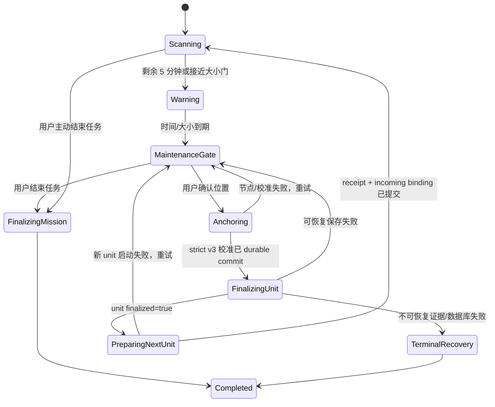

# 大型门店周期强制人工校准与自动分卷存盘需求文档

> 文档状态：**当前有效（需求基线，尚未实现）**。最后核对日期：2026-09-04。
> 适用产品：MarketScanner iPhone Pro 采集端、Mobile-Only 工作流、Supermarket Map Studio PC 端。
> 适用模式：P0 只对 `prior_map_localized`（已有地图辅助扫描）开放。`free_mapping` 没有绝对地图位置可供人工确认，不得把普通点选伪装成同等的绝对位置校准。
> 当前实现边界：现有生产行为仍是“一次扫描一个连续 SQLite 数据库”，当前源码没有自动 rollover。本文描述的是待开发目标，不得据此宣称功能已经上线或通过真机/现场验收。

## 1. 需求原文与产品结论

现场反馈：

> “门店都比较大，希望能在采集一段时间，例如 30 分钟，强制要求进行位置点手动校准，并自动进行一个文件存储避免文件太大；避免工人去操作的时候不知道什么时候做手动位置校准，不知道存盘。”

该反馈实际包含三个必须一起解决的问题：

1. **定位质量问题**：长距离、长时间扫描会积累平移和航向误差，需要定期获得可信绝对地图锚点。
2. **数据安全与文件规模问题**：一个数据库持续增长，会增加最终保存、复制、恢复和 PC 处理的成本；普通 JSON 检查点并不能限制 SQLite 文件大小。
3. **一线操作问题**：校准和存盘依赖工人记忆，容易发生忘记、拖延、误以为已保存或在保存期间继续走动。

本需求采用以下产品结论：

- 默认每累计 **30 分钟有效采集时间**进入不可跳过的维护门；维护门内只允许完成位置校准、存盘、重试或结束任务，不能继续普通采集。
- 位置确认必须复用现有 strict v3 exact-node 人工重定位，不新增低可信的“点一下就算校准”旁路。
- 校准成功后自动把当前数据库封口为一个不可变采集单元，再创建下一个独立单库继续采集。
- 不在同一 `continuous_streaming` 会话中创建 `segment_0002`。一个大型门店任务由多个独立、可校验的单库采集单元组成，避免恢复已经退出生产入口的旧式自动分段语义。
- “已存盘”只在 SQLite 保存、必需 sidecar、`metadata.json(finalized=true)`、checkpoint 清理和数据库句柄脱离全部完成后显示。写一个 `live_checkpoint.json`、调用 flush 或后台复制开始，都不能显示为“已存盘”。
- 自动封口首先保存到 App 本地受控目录。只有用户预先选择并授权了外部目录时，才后台执行现有的逐文件 SHA-256 复核复制；外部复制失败不得删除本地唯一副本。

## 2. 当前实现与问题分析

### 2.1 已有能力

当前代码已经具备以下基础：

- `ViewController.updateStreamingCaptureHealth()` 每 15 秒统计数据库实际占用、会话目录占用、磁盘余量、内存和 thermal 状态，并原子写入 `live_checkpoint.json`。
- 可用空间低于 8 GiB 时告警，低于 1 GiB 或 thermal 达到 `critical` 时会停止并封口当前数据库。
- `SupermarketScanSession` 在扫描期间持续写数据库和 sidecar；最终保存完成后才提交 `metadata.json`，并以 `finalized=true` 作为不可逆完成标志。
- 人工重定位已经使用 `MarketScannerManualLocalizationEvent v3`：请求一个提交后的新节点，严格绑定 node ID、node stamp、node-time snapshot、tracking/map/floor 身份；审计记录先持久化，成功后才改变实时 alignment。
- 终止保存已经具备 admission close、ARSession/native producer 暂停、writer 排空、数据库保存、sidecar 水位校验、metadata 提交、checkpoint 清理和后台外部复制等安全步骤。
- Mobile-Only workflow 已有 `scanning -> finalizingScan -> idle` 的持久状态，以及扫描 receipt/context 的恢复校验。

### 2.2 当前缺口

当前实现仍不能满足现场反馈：

| 缺口 | 当前表现 | 直接后果 |
| --- | --- | --- |
| 无周期调度 | 没有 30 分钟计时、倒计时或到期状态 | 工人必须凭经验决定何时校准 |
| 无强制门 | “重新选择位置”是主动操作，扫描可一直继续 | 校准被忽略后误差继续累计 |
| 无自动换卷 | `stopMapping()` 明确只有终止封口，没有 rollover 路径 | 单个 SQLite 文件持续增大 |
| checkpoint 容易被误解 | 15 秒 checkpoint 只是运行中状态摘要 | 它既不是 finalized 成果，也不能降低 DB 大小 |
| 无跨文件任务身份 | PC 以单个 `SupermarketSession-*` 为主要输入 | 自动产生多个文件后无法证明顺序、边界和完整性 |
| 恢复状态不覆盖换卷 | 崩溃恢复只认识 scanning/finalizing | 可能出现上一卷已封口、下一卷未建立或孤儿目录 |
| 自由建图语义不成立 | 无先验地图时不能确认绝对 X/Y/yaw | 不能声称完成了“位置点手动校准” |

### 2.3 为什么不能只“每 30 分钟保存一次”

SQLite/RTAB-Map 在扫描期间已经持续把旧节点写入同一个磁盘数据库。额外写一次 checkpoint 或执行数据库 flush 只能降低异常断电时的未落盘窗口，不能让已有数据库变小。若继续写同一文件，文件大小仍会增长。

因此，限制单文件规模必须经过真实边界：

```text
关闭普通采集 admission
  -> 完成人工 exact-node 校准
  -> 停止生产者并排空 writer
  -> 保存并封口当前 SQLite + sidecar + metadata
  -> 脱离已封口数据库
  -> 创建新的独立会话数据库和 durable start receipt
  -> 写入跨单元边界证据
  -> 恢复普通采集
```

## 3. 目标、成功指标与非目标

### 3.1 目标

- 工人随时能看到距下一次强制校准/自动存盘的剩余时间。
- 到期后系统主动阻断继续走动采集，直到校准和自动存盘完成。
- 每个采集单元默认不超过 30 分钟有效采集时间，并受独立文件大小软门约束。
- 已完成单元可独立校验、恢复、导出和 PC 处理；某一单元损坏不应静默污染其他单元。
- 多个单元在 PC 端仍属于同一个门店任务，顺序、地图身份、边界锚点和 hash 链可验证。
- 崩溃、锁屏、低磁盘、写入失败或新文件启动失败时，不产生“界面显示继续扫描但没有安全写库”的幽灵采集。

### 3.2 成功指标

- 30 分钟到期检测至普通采集 admission 关闭：不超过 1 秒。
- 到期后未经合格校准和新单元 start receipt 提交，普通节点、价签确认和定位修正新增数量均为 0。
- 2 小时真机连续任务可形成 4 个有序单元，所有单元均有唯一身份、`finalized=true`、无 live checkpoint、数据库 SHA-256 和边界证据。
- 100 次模拟换卷中不出现重复 unit index、同一路径覆盖、已封口数据库重新打开写入或 mission 清单指向不存在文件。
- 校准审计写失败时 alignment 不改变；旧单元保存失败时不启动新单元。
- PC 对缺卷、重复卷、乱序卷、地图/floor 身份变化、边界证据不完整和 hash 不一致全部 fail closed；仍可按明确的 diagnostic/partial 状态查看已验证单元，不能发布完整任务。
- 工人手测能够在不阅读培训材料的情况下说明：还剩多久、当前为何不能继续、正在执行哪一步、哪个文件已保存、何时可以继续走动。

### 3.3 非目标

- 不恢复旧式 `segment_0002`、手机端自动拼图或在原始数据库内做就地优化。
- 不因周期存盘自动删除手机本地原始数据。
- 不把 Files/iCloud/外接存储的“copy returned”当作断电持久化证明。
- 不在 P0 为自由建图伪造绝对地图坐标；该模式需要另立“回到重叠区域/控制点”的产品需求。
- 不用 30 分钟规则替代 tracking、回环、结构覆盖、低磁盘、thermal 和证据完整性门。

## 4. 术语与数据模型

| 术语 | 定义 |
| --- | --- |
| 门店任务（Mission） | 一次完整门店/楼层采集工作，包含一个或多个采集单元 |
| 采集单元（Unit） | 一个独立 `SupermarketSession-*` 目录；内部仍只有 `segment_0001/rtabmap_segment_0001.db` |
| 维护门（Maintenance Gate） | 普通采集被关闭，只能校准、存盘、重试或结束的强制状态 |
| 边界校准（Boundary Calibration） | 在单元结尾完成的 strict v3 exact-node 人工位置确认，并作为下一单元起始地图位姿来源 |
| 自动封口（Auto Finalize） | 保存数据库、封口 sidecar、提交 metadata、清理 checkpoint、脱离数据库的完整事务 |
| 外部复制（External Copy） | 在本地封口成功后，将不可变单元复制到用户授权目录并做源/目标/源三方 hash 复核 |
| 有效采集时间 | 普通采集 admission 已打开且处于真实 mapping 的单调时钟累计；不含校准弹窗、封口、新卷启动、后台和中断时间 |

建议引入新的 mission 容器；每个 unit 仍保持现有单库布局：

```text
SupermarketMission-YYYYMMDD-HHMMSS/
  mission_live_checkpoint.json       # 任务未结束时的原子状态快照
  mission_events.jsonl               # append-only 状态与故障审计
  mission_manifest.json              # 整个任务结束后的不可变提交清单
  boundaries/
    boundary_0001.json               # unit 1 -> unit 2 的双端绑定
  units/
    SupermarketSession-...-U0001/
      segment_0001/
        rtabmap_segment_0001.db
        metadata.json
        ...现有 sidecar...
    SupermarketSession-...-U0002/
      segment_0001/
        rtabmap_segment_0001.db
        metadata.json
        ...现有 sidecar...
```

不得使用 symlink/hardlink 引用 unit。旧版单个 `SupermarketSession-*` 继续按“一项只有一个 unit 的 legacy mission”读取。

## 5. 触发策略

### 5.1 默认参数

| 参数 | P0 默认值 | 说明 |
| --- | --- | --- |
| `calibrationAndRolloverIntervalS` | 1800 秒 | 由部署策略控制，工人不可在扫描中关闭 |
| 第一次提醒 | 剩余 5 分钟 | HUD 变黄、语音一次、触感一次 |
| 第二次提醒 | 剩余 1 分钟 | 固定顶部提示和每秒倒计时 |
| 最后提醒 | 剩余 30 秒 | HUD 变红、语音和更强触感 |
| 到期宽限 | 0 秒 | 到点即关闭普通采集 admission |
| `softMaxUnitBytes` | **待真机 30 分钟/2 小时基线后冻结** | 不能用拍脑袋数值替代设备数据 |
| 磁盘告警/终止 | 沿用 8 GiB / 1 GiB | 1 GiB 为终止保存，不自动启动下一卷 |

### 5.2 时间口径

- 计时从 `mapping_started`、数据库存在、相机 active 且 durable scan receipt/context 全部成功后开始。
- 使用 `ProcessInfo.systemUptime` 的差值累计，禁止用可被用户改动的墙上时间判定到期。
- 每 15 秒 checkpoint 和每次状态转换都持久化 `activeCaptureElapsedS`、`nextMaintenanceAtActiveS`、当前 unit index 和 policy version。
- App 进入后台、系统中断、维护门、finalization、外部复制和 next-unit prepare 不计入有效采集时间。
- 进程重启后不得重新获得 30 分钟；从 checkpoint 恢复累计值。若恢复时已到期，首页确认后直接进入维护门。
- 工人在 30 分钟内主动做普通人工重定位，不取消本次 unit 的边界换卷。边界校准必须靠近 unit 的最终节点，才能提供可靠跨文件证据。

### 5.3 字节与资源触发

定时只能限制通常情况下的文件规模，不能覆盖纹理复杂度、节点率或 sidecar 异常增长。因此系统还必须：

- 在后台按不高于 5 秒一次的频率统计 DB 主文件、`-wal`/`-journal`（若存在）和 unit sidecar 总占用；UI 的 1 秒倒计时不得触发目录遍历。
- 使用最近至少 3 个样本估计增长速率；当 `当前占用 + 预计未来 60 秒增长 + finalization 预留空间 >= softMaxUnitBytes` 时提前进入同一个维护门，原因显示为“文件大小即将达到上限”。
- `softMaxUnitBytes` 必须通过目标 iPhone、真实 LiDAR 路线、Files Provider 和 PC 处理基线后冻结；未冻结时只能启用 30 分钟时间门和现有磁盘安全门，不能宣称有严格字节上限。
- 触发优先级为：证据/数据库写入故障 > 可用空间不足 1 GiB > thermal critical > 文件大小门 > 30 分钟时间门。前 3 类安全故障只执行终止保存或恢复包封口，不自动开始下一卷。

## 6. 手机端交互需求

### 6.1 常驻 HUD

扫描主界面必须常驻以下信息：

- `第 1 个文件 · 已采集 12:28`
- `距校准并存盘 17:32`
- 当前文件大小，例如 `2.1 GiB`
- 当前状态：`采集中 / 即将维护 / 请原地校准 / 正在存盘 / 正在创建新文件 / 可继续`

HUD 采用文字、颜色和图标共同表达，不得只靠颜色；支持 Dynamic Type 和 VoiceOver。扫码价签 overlay 出现时，维护倒计时仍必须可见。

### 6.2 提醒

- 剩余 5 分钟：提示“5 分钟后需要原地停下，完成位置校准和自动存盘”。
- 剩余 1 分钟：顶部固定提示，不再使用几秒后消失的 toast。
- 剩余 30 秒：红色倒计时；语音提示工人前往地图上容易确认的位置，但不能诱导快速走动。
- 已进入维护门：全屏显示“请停止走动”，触感反馈，禁止通过点击背景、返回手势或“稍后”关闭。

### 6.3 强制维护页

维护页采用明确的三步流程：

1. **确认当前位置**：显示已绑定楼层地图，复用现有 X/Y/yaw、缩放、平移、离散方向和微调控件。
2. **自动保存第 N 个文件**：显示“等待稳定节点 -> 写入校准审计 -> 保存数据库 -> 封口证据 -> 校验完成”的逐步进度。
3. **创建第 N+1 个文件**：显示新数据库、边界双端绑定和 recording receipt 的建立进度；全部完成后给出明显的“可以继续走动”。

允许的操作只有：

- `确认位置并存盘`；
- 校准失败后的 `重新选择位置`；
- 保存/启动失败后的 `重试`；
- `结束本次任务并安全存盘`。

P0 不提供工人侧“跳过”“稍后”“仍然继续扫描”。若业务未来需要 supervisor override，必须独立设计身份、原因、审计和发布降级，不能用隐藏按钮绕过。

### 6.4 提示语义

- “已完成校准”：v3 event 已持久化且 live alignment 已提交。
- “第 N 个文件已存盘”：该 unit 已满足 `metadata.finalized=true`、live checkpoint 已清理、数据库已脱离且本地文件仍存在。
- “正在后台复制”：仅表示外部复制尚未完成，不能替代本地已存盘状态。
- “可继续”：新 unit 数据库已存在，ARSession/RTAB-Map 正在记录，required writers、receipt/context 和 incoming boundary binding 全部 durable。

## 7. 边界校准需求

### 7.1 校准前提

- workflow 必须是 `prior_map_localized`，且 mission 全程绑定同一个 prior map ID、package SHA、store ID 和 floor ID。
- tracking 必须稳定；地图、floor 和 coordinate contract 必须仍有效。
- 禁止在 localization required write failure、pending price-tag confirmation 或已有人工校准事务未完成时开始换卷。
- 进入维护门后普通 mapping admission 关闭，但允许一个窄范围的 one-shot manual-anchor node creation，使用户确认后的新稳定帧能生成 exact node。

### 7.2 提交流程

1. 用户选择 canonical X/Y/yaw 并确认最后一次文本编辑。
2. 请求 one-shot post-request node；超时或 tracking 不稳时保持维护页，允许重试，不改变 alignment。
3. 对 node ID、stamp、node-time delta、snapshot generation、tracking/map/floor identity 和 alignment version 做现有 strict v3 校验。
4. 先 durable append `manual_localization_events.jsonl`，再 CAS 提交 live alignment。
5. 生成唯一 `boundaryCheckpointId`，把 confirmed map pose、outgoing exact node 和 manual event hash 写入 mission event。
6. 只有第 5 步成功才允许进入 unit finalization。

### 7.3 下一单元的入站绑定

新 unit 启动后、恢复普通走动前必须：

- 将上一边界确认的 canonical pose 用作新 unit 的 `initialMapPose`，并记录 `initialMapPoseSource=periodic_boundary`；
- 保持相同 map/store/floor identity；
- 请求新数据库中的首个稳定 exact node，写入 incoming boundary binding；
- 原子提交 `boundaries/boundary_NNNN.json`，其中同时包含 outgoing unit 和 incoming unit 的 tracking session、node、stamp、pose、receipt/hash；
- PC 只在双端证据完整时把它作为跨 unit 强锚点。只有 outgoing 端时，上一单元仍可独立处理，但 mission 不完整且不得整体发布。

## 8. 自动分卷与持久化事务

### 8.1 状态机



### 8.2 原子换卷顺序

1. **触发线性化**：写 `maintenance_gate_entered`，关闭普通 mapping/tag/localization admission；取消未完成价签 burst，或在进入维护门前给出短暂有界排空。
2. **保持校准最小生产路径**：ARSession 与 native mapping 仅为 one-shot exact node 保持工作；界面明确要求原地静止。
3. **提交边界校准**：按第 7 节完成 durable-first 人工锚点。
4. **冻结旧 unit**：暂停 ARSession、camera producer 和 native mapping；等待先前获准的 writer/confirmation transaction 排空。
5. **保存旧 DB**：调用 RTAB-Map save，测量保存后的 DB/WAL/目录实际大小，写 terminal performance sample。
6. **封口 sidecar**：flush clock、tag burst、localization/recovery、pose epoch、corridor/shelf/loop 和其他 required evidence，验证水位。
7. **提交旧 unit**：最后写 `metadata.json`。只有合格证据才为 `finalized=true`；随后删除旧 live checkpoint并脱离 DB 句柄。
8. **更新 mission 状态**：以 unit metadata/database SHA、unit index、boundary ID 和 previous-unit hash 更新 `mission_live_checkpoint.json`；append `unit_finalized`。
9. **建立新 unit**：创建全新目录、tracking session ID、数据库、sidecar writers、prepared prior-map localizer 和 scan receipt；禁止覆盖或 reopen 已封口目录。
10. **提交入站边界**：新 unit 首个 exact node 与上一校准 pose 绑定，完成双端 boundary 文件和 mission audit。
11. **恢复采集**：只有 camera active、RTAB-Map recording、required writers、receipt/context、boundary 和数据库文件全都存在且身份一致时，打开普通 admission并把有效时间归零。
12. **后台外部复制**：若存在有效安全域书签，对旧 unit 执行现有三方 SHA 复制；一次只复制一个 unit，保留本地源。复制失败显示持续告警，但只要本地空间门仍安全，可以继续当前新 unit。

### 8.3 任务结束

- 工人主动结束或安全门终止时，不创建空的新 unit。
- 最后一个 unit 使用现有终止 finalization；若已在维护门且校准成功，可直接封口。
- 所有 unit 封口后生成不可变 `mission_manifest.json`，列出 unit/boundary 的相对路径、SHA-256、大小、有效采集时长、触发原因、地图身份和完整性结论。
- `mission_manifest.json` 是 mission 完成标志；运行中的 `mission_live_checkpoint.json` 不能被 PC 当作完整任务。

## 9. Schema 增量

### 9.1 unit metadata/checkpoint

现有 `ScanSegmentMetadata` 和 `ScanLiveCheckpoint` 增加可选字段，以保持旧数据可读：

```json
{
  "missionId": "uuid",
  "missionFormatVersion": 1,
  "unitId": "uuid",
  "unitIndex": 1,
  "previousUnitId": null,
  "previousUnitMetadataSha256": null,
  "rolloverTrigger": "time_limit|size_limit|operator_stop|safety_stop",
  "activeCaptureDurationS": 1800.3,
  "maintenancePolicyVersion": 1,
  "calibrationIntervalS": 1800,
  "boundaryCheckpointId": "uuid-or-null",
  "boundaryManualEventSha256": "sha256-or-null",
  "unitStorageBytes": 0,
  "nextMaintenanceAtActiveS": 1800,
  "maintenanceState": "scanning|warning|gate|anchoring|finalizing|preparing_next"
}
```

字段命名最终应遵循现有 Swift 编码风格；上例表达语义，不是未经评审即可发布的冻结 wire schema。

### 9.2 mission 与 boundary

`mission_live_checkpoint.json` 至少包含：

- mission ID、policy version、map/store/floor/build identity；
- current unit ID/index/path/tracking session；
- active elapsed、触发原因、当前状态和最近一次状态提交时间；
- 已封口 unit 的相对路径、metadata SHA、database SHA 和 previous hash；
- pending boundary ID 及 outgoing/incoming 完成标记；
- 外部复制队列和最近错误，但外部复制状态不改变本地 unit 完整性。

`boundary_NNNN.json` 至少包含：

- format/version、mission ID、boundary ID、from/to unit identity；
- prior map ID/SHA、store/floor；
- confirmed canonical X/Y/yaw；
- outgoing exact node/time/snapshot generation/manual event hash；
- incoming exact node/time/snapshot generation/start receipt hash；
- created/committed 时间、完整性结论和文件 SHA。

所有路径必须是 mission root 内的 canonical relative path；拒绝绝对路径、`..`、symlink、hardlink、重复 unit/boundary ID 和大小/mtime/inode 在校验期间变化。

## 10. 崩溃、失败与恢复

| 故障点 | 恢复策略 | 是否允许普通采集继续 |
| --- | --- | --- |
| 提醒阶段崩溃 | 从 active elapsed 恢复；已到期则立即进维护门 | 到期前允许，到期后不允许 |
| 选点/等待 exact node 失败 | 保持旧 DB 和维护门，alignment 不变，可重试 | 不允许 |
| manual event 写失败 | 记录 sticky evidence failure，旧 DB 封为 ineligible/recovery | 不允许自动开下一卷 |
| DB save 失败且未提交 metadata | 保留 live checkpoint，允许在原地重试安全封口 | 不允许 |
| `metadata.finalized=false` 已提交 | 旧 unit 进入 terminal recovery，不得 reopen 写入 | 不允许自动继续 prior-map mission |
| `finalized=true` 但 checkpoint 清理失败 | 旧 DB 保持关闭，提示“已封口、待验证清理” | 默认不继续；完成同身份/时间 CAS 清理后可重试 |
| 旧 unit 已完成，新 unit 创建失败 | 旧 unit 不回滚；保持 `preparing_next`，重试同一个 next index | 不允许 |
| 新 DB 已创建，receipt 未提交 | 重启后核对身份；能够证明是 pending unit 时完成提交，否则隔离为 orphan | 不允许 |
| incoming boundary 未提交 | 新 unit 保持不可采集；重建首节点绑定或隔离未开始的 unit | 不允许 |
| 外部复制失败 | 保留本地 unit，进入可见重试队列 | 本地空间安全且换卷事务已完成时允许 |
| 低于 1 GiB/thermal critical | 只封口当前 unit 并结束 mission，不开下一卷 | 不允许 |

恢复逻辑必须幂等：相同 recovery 操作重复执行，不得产生第二个 unit index、第二个 boundary ID 或覆盖已经 finalized 的 metadata。

## 11. PC 端处理工作流

### 11.1 输入检查

Map Studio 新增“门店任务”输入类型：

1. 读取 finalized `mission_manifest.json`，或对明确选择的未完成 mission 只提供 diagnostic inspection。
2. 校验 mission/map/store/floor/build identity、unit index 连续性、previous hash 链和所有文件路径边界。
3. 对每个 unit 复用现有规则：唯一 `segment_0001`、`continuous_streaming`、`metadata.finalized=true`、无 live checkpoint、DB/sidecar/manifest identity 和水位完整。
4. 校验每个相邻 unit 之间恰好一个完整 boundary；outgoing/incoming exact node 和 confirmed pose 必须一致。
5. 缺卷、乱序、重复、hash 不匹配或 boundary 不完整时，允许查看已验证单元的诊断结果，但 mission 的 `publish_permitted=false`。

### 11.2 处理与合并

- 每个 unit 的原始数据库保持只读，分别生成独立 optimized 副本和质量报告。
- 对每个 unit 先恢复 gauge-neutral 物理轨迹，再应用本 unit strict manual anchors、结构/道路和货架约束。
- unit 间不通过“最近两点”或目录顺序盲拼。使用已验证的双端 boundary map pose 作为共同绝对锚点，并保留 boundary 前后相邻步长、yaw、时间 gap 和 correction gradient 审计。
- 生成 mission 级连续时间线、轨迹、价签和性能汇总时，保留 `unit_id`、`unit_index`、source node ID 和 source timestamp，不重新编号后丢失来源。
- 单 unit 可以独立产出；完整 mission 发布必须所有必需 unit/边界通过。低置信算法结果可保留为 review draft，身份/framing/hash/atomic commit 损坏继续 fatal。
- PC 输出写入新的 mission result 目录；不得修改任何手机原始 unit。

### 11.3 Map Studio 展示

任务详情至少展示：

- unit 时间轴、每卷有效时长/大小/节点数/触发原因；
- 每次边界校准的位置、方向、outgoing/incoming node 和校验状态；
- 保存耗时、新卷启动耗时、外部复制状态；
- 缺卷、失败卷、orphan、checkpoint 和 hash 链告警；
- 单卷质量与 mission 总体 publication gate。

## 12. 代码修改清单

### 12.1 iOS Foundation 核心

建议新增 `PeriodicScanMaintenanceCore.swift`，保持 Foundation-only，包含：

- policy、单调计时累计、warning/trigger 判定；
- `scanning/warning/gate/anchoring/finalizing/preparingNext/terminal` 状态机；
- unit/boundary/mission schema；
- crash recovery reconciliation 和幂等 transition planner；
- 文件大小增长预测与 finalization headroom 判定。

这样核心状态和时间逻辑可以在 macOS host tests 中完成确定性故障注入，不依赖 UIKit Timer。

### 12.2 `ViewController.swift`

- 在真实 `mapping_started` 后启动 maintenance coordinator，而不是从进入配置页开始计时。
- HUD 每秒只读取状态快照；文件 stat/目录统计在后台低频执行。
- 到期时关闭普通 admission，协调 price-tag burst、manual request 和 finalization，展示不可跳过维护页。
- 把现有 `applyManualPriorMapPose()` 作为边界校准唯一入口，增加 `reason=periodic_unit_boundary` 和 completion 回调链。
- 将现有终止型 `finalizeStreamingScan()` 拆出可复用的 `finalizeStreamingUnit(reason:completion:)`；普通 Stop 仍走 terminal，周期换卷成功后走 next-unit start。
- snapshot 当前 map configuration/prepared package，封口后复用同一身份创建新 localizer/DB；不得依赖 `completeCurrentSession()` 后已清空的配置。
- 只有 next receipt 和 incoming boundary 都提交后恢复 `.STATE_MAPPING` 和普通 admission。

### 12.3 `SupermarketScanSession.swift`

- 扩展 metadata/live checkpoint 的可选 mission/unit/maintenance 字段。
- 新增显式 `beginUnit`、`sealUnit`、`detachFinalizedUnit`；禁止通过 `segmentIndex += 1` 生成额外 segment。
- 增加 mission root、unit collision-free path、relative-path 校验、hash chain 和 boundary 原子 writer。
- 保留现有 durable-first manual event、finalization admission、水位校验和 checkpoint commit 语义。
- 外部复制从“单 session”扩展为按 finalized unit 队列复制；本地保留策略不变。

### 12.4 Mobile-Only workflow

扩展持久状态：

```text
scanning
  -> maintenanceGate
  -> anchoring
  -> finalizingUnit
  -> preparingNextUnit
  -> scanning
```

context 增加 mission/unit/boundary ID、active elapsed、pending next receipt 和 trigger。启动/恢复仍须满足 current receipt、session path、source DB 和 map identity 一致。已有 `finalizing_scan` 继续表示 terminal Stop；不能让旧版本把 `finalizingUnit` 误判成可直接后处理的 finalized 输入。

### 12.5 RTAB-Map/native 桥接

优先复用已有 `save()`、`openDatabase(clearDatabase:true)`、`setPausedMapping()` 和 one-shot manual-anchor node creation。实现前必须验证：

- save 后 DB/WAL 已形成可独立打开的一致快照；
- 切换新 DB 前旧 DB 的所有句柄确实脱离；
- ARSession reset 与不 reset 两条路径的 pose epoch、clock binding 和首节点证据都正确；
- 新 unit 不会继承旧 unit 的 WM/LTM node identity、sidecar watermarks 或 tag burst。

若现有接口不能证明上述条件，再增加窄范围 `close/finalize/open` API；不得用延时等待代替句柄与事务完成信号。

### 12.6 PC 与 Web

- 新增严格 mission parser/validator，并在 `server.py` 增加 mission inspect/process API。
- `offline_processing.py` 增加 per-unit orchestration、boundary 校验和 mission 级结果聚合。
- Web 增加 unit 时间轴、边界详情、总体 gate 和 artifact 下载。
- 继续复用单 unit 处理器；不要把多个源 DB 先复制成一个可写 DB 再处理。

### 12.7 文档

功能实现时必须同次更新：

- 根目录 `README.md`；
- `docs/map-assisted-localization/{ARCHITECTURE,DATA_FORMATS,MOBILE_UX,PC_UX,TEST_PLAN,IMPLEMENTATION_STATUS,CHANGELOG}.md`；
- `doc/.local/app/ios/SUPERMARKET_SEGMENT_STORAGE_CN.md`；
- `doc/.local/tools/SupermarketMapStudio/{README_CN,DESIGN_CN}.md`；
- `doc/.local/DOCUMENT_STATUS.md`。

实现完成前，上述当前文档仍应描述连续单库现状，并链接本文为“尚未实现需求”，不能提前改写成已上线行为。

## 13. 实施顺序与完整开发工作流

### 阶段 0：冻结产品口径与真机基线

1. 确认 P0 只用于已有地图模式、30 分钟为默认且工人不可跳过。
2. 在目标 iPhone 上执行 30 分钟和 2 小时真实 LiDAR 采集，记录每 5 秒 unit bytes、节点率、FPS、热状态、磁盘、保存耗时和外部复制耗时。
3. 以 p95 增长和 finalization 空间需求冻结 `softMaxUnitBytes`；不得从 host fixture 推断真机阈值。
4. 确认现场允许的最长暂停时间、语音/震动和 supervisor policy。

### 阶段 1：纯核心、schema 与恢复

1. 实现 Foundation-only maintenance state machine、monotonic accumulator 和 trigger policy。
2. 实现 mission/unit/boundary schema、strict parser、原子写、hash chain 和 crash reconciliation。
3. 添加 clock jump、进程重启、重复 callback、unit collision、orphan 和每个事务边界的故障注入测试。
4. 在 feature flag 关闭状态合入；旧单 session 行为逐字节/回归保持兼容。

### 阶段 2：iOS 强制 UX 与 exact-node 校准

1. 接入 HUD、5 分钟/1 分钟/30 秒提醒和不可跳过维护页。
2. 将维护门接到现有 durable-first `applyManualPriorMapPose()`。
3. 验证 one-shot node timeout、tracking loss、最后文本编辑、地图 bounds 和 audit write failure。
4. 此阶段即使校准成功也先在测试开关下执行模拟封口，不对现场开放半成品流程。

### 阶段 3：自动封口与新单元启动

1. 抽取可复用 unit finalization completion，保持现有 terminal Stop 行为。
2. 实现旧 unit sealed -> manifest checkpoint -> 新 unit start receipt -> incoming binding -> resume 的事务。
3. 加入外部复制串行队列和持续可见状态。
4. 完成所有阶段故障恢复；任何未知状态默认保持停止和保留文件。

### 阶段 4：PC mission 处理

1. 实现 strict mission validator 和单元枚举。
2. 复用单元优化，新增 boundary-aware mission 聚合。
3. 增加 Web 时间轴、边界证据、partial/diagnostic 与 publication gate。
4. 用 1、2、4、8 个 unit 的合成与真实任务验证确定性输出和内存上限。

### 阶段 5：资格与灰度

1. 完整 host 单测、Swift parse、Python/JavaScript 语法、native、Map Studio、Xcode Debug/Release 构建。
2. clean exact-commit Release bundle identity 核对。
3. 签名真机执行第 14 节矩阵；至少完成 2 小时/4 单元无崩溃路线。
4. PC 导入同一真机 mission，核对 unit、boundary、时间线、价签、性能和发布门。
5. 先对内部测试人员灰度；观察换卷失败率、平均暂停、文件 p95、复制 backlog 和人为退出，再决定是否默认开启。

## 14. 测试与验收矩阵

### 14.1 自动化

- 时间：1799/1800/1801 秒、Timer 延迟、墙上时间回拨/前跳、后台暂停、重启恢复、重复回调。
- 提醒：5 分钟/1 分钟/30 秒各出现一次；Dynamic Type、VoiceOver、横竖屏和价签 overlay 不遮挡核心状态。
- 强制门：到期后普通 node/tag/localization writes 被拒；one-shot anchor node 仍可完成。
- 校准：有效/越界/NaN、tracking lost、node timeout、旧 node、错误 map/floor、event append failure、CAS conflict。
- 保存：DB save、各 required sidecar、metadata、checkpoint cleanup、detach 每一步故障注入。
- 换卷：新目录冲突、open DB 失败、camera 失败、receipt 失败、incoming binding 失败、重复恢复。
- 文件：DB/WAL/sidecar 总大小、增长预测、soft limit、1 GiB/8 GiB 磁盘门、外部复制失败和 hash mismatch。
- PC：missing/duplicate/reordered unit、broken previous hash、missing/one-sided boundary、identity drift、symlink/hardlink/path escape、legacy single session。
- 兼容：feature flag off 时现有单 session 的 metadata、finalization、历史列表、导出和 PC 处理行为不变。

### 14.2 真机

- 时长：30 分钟、65 分钟、2 小时；应分别覆盖 1 次、2 次和 3 次自动边界换卷，2 小时任务正常结束后共 4 个 finalized unit。
- 状态：nominal/fair/serious/critical thermal，充电/不充电，低电量，8 GiB/1 GiB 余量。
- 中断：来电/控制中心/前后台/锁屏、在选点时强杀、保存时强杀、新卷启动时强杀、外部复制时强杀。
- 位置：20 次边界校准；覆盖 zoom/pan、数值编辑、方向键、±1/5/15°、tracking loss/recovery 和相似平行通道。
- 数据：每个 unit 的 DB 可独立 quick/integrity/Node/Link 检查，metadata/hash/checkpoint/receipt/boundary 一致。
- 体验：戴手套/强光/嘈杂环境，语音关闭时仍能依靠视觉和触感完成；保存期间误触/走动不会继续记普通节点。
- 外部存储：Files 本地、iCloud、至少一种真实第三方 File Provider 和外接存储；验证后台复制不影响当前 unit FPS，失败不删除手机源。

### 14.3 现场发布门

以下证据全部具备前不得声明生产完成：

- 签名 Release 真机 2 小时连续任务；
- 4 个 unit 和 3 个双端 boundary 全部严格通过；
- 自动存盘/新卷启动无幽灵采集、无覆盖、无丢失本地源；
- PC mission 结果可重放且原始 DB hash 前后不变；
- 人工边界前后轨迹不存在由换卷制造的异常步长/航向跳变；
- 热、低磁盘、强杀和 File Provider 失败路径均有明确恢复结论；
- 现场工人可独立完成整套交互，且没有“以为已经保存但实际未 finalized”的误解。

## 15. 风险与控制

| 风险 | 控制措施 |
| --- | --- |
| 频繁停顿降低效率 | 提前 5 分钟引导工人走到易确认位置；记录实际暂停 p50/p95 后再优化 |
| 校准位置选错导致强拉轨迹 | strict map/floor/bounds/exact-node 身份；PC 保留残差和低置信门，不用 UI 成功替代后验质量 |
| 30 分钟仍产生超大文件 | 增加独立字节软门和增长预测；阈值由真机基线冻结 |
| 换卷丢失轨迹连续性 | outgoing + incoming 双端 boundary，首节点未绑定前不恢复走动 |
| 保存过程中继续采集 | admission 线性化、暂停 producer、writer drain；UI 明确“请原地停留” |
| 新旧文件串写 | 每 unit 唯一 tracking session、全新目录和 receipt；已 finalized 路径禁止 reopen |
| 外部复制拖慢新扫描 | 本地先提交、复制串行/节流、保留源、监控 backlog 和 FPS |
| 崩溃造成孤儿 unit | mission checkpoint + append-only event + 幂等 reconciliation；未知目录隔离不自动接纳 |
| 旧 PC/App 无法识别 mission | 保持 unit 内单 session 兼容形状；新 PC 支持 mission，旧 PC 仍可逐 unit 处理 |

## 16. 待产品确认项

以下项目不阻碍本需求文档作为开发基线，但在默认开启前必须冻结：

1. 30 分钟是否所有门店统一，还是由受控部署策略按门店/设备设置；工人端不应可随意修改。
2. 真机数据得出的 `softMaxUnitBytes`、finalization 空间预留和复制 backlog 上限。
3. 校准与存盘 P95 可接受暂停时长；超时多久升级为主管介入。
4. 外部目录已授权时，是每卷自动复制，还是仅在任务结束后统一复制；无论哪种都必须本地先封口并保留源。
5. 是否需要 supervisor override。若需要，必须定义身份认证、强制原因、审计字段和 `publish_permitted=false` 策略。
6. `free_mapping` 的独立方案：只自动分卷，还是增加现场控制点/重叠区校准。未决定前 P0 不对该模式显示“位置校准成功”。

## 17. Definition of Done

本需求只有同时满足以下条件才算完成：

- 产品参数和 P0 模式范围冻结；
- iOS 提醒、强制校准、自动 unit finalization、新 unit start 和崩溃恢复全部实现；
- mission/unit/boundary schema 与 PC strict validator 同步实现；
- 旧单 session 输入和现有终止保存路径无回归；
- 自动化、clean exact-commit 构建、签名真机和现场矩阵通过；
- 文档、用户培训文案、Map Studio 展示和错误处理同次更新；
- 能用文件、事件、hash、receipt、真机录像/日志证明“何时提醒、何时阻断、校准是否可信、哪个文件真正存盘、何时开始下一卷”，而不是仅凭界面截图宣称完成。
